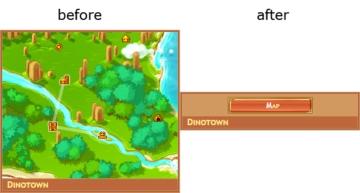
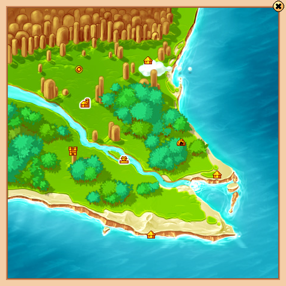
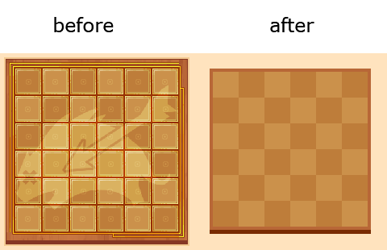

# dinoTools
You can install this userscript with this [link](https://github.com/Angelisium/dinoTools/raw/master/dinoTools.user.js).

dinoTools is a tampermonkey userscript I had written to emule flash elements with HTML5.
The original script had a php dependency for generating the html structure ... which I didn't like.
No longer playing the game, and thinking that no one was using it, I decided to delete it.

What was my surprise to receive emails informing me that the userscript was no longer working. 😂

So I hastened to rewrite the script... without dependencies this time. 🥳

This userscript is functional on versions [DE](http://www.dinorpg.de/), [EN](http://en.dinorpg.com/), [ES](http://es.dinorpg.com/) and [FR](http://www.dinorpg.com/).

## Currently emulate by the userscript:

### The map :
The map is replaced by a full screen HTML5 version which is displayed when clicking on a button provided for this purpose.

HTML5 fullscreen version :

There are two ways you can get around. The classic way (left click) that redirects to the fight page ... to watch the fight. And the fast way (right click) which moves you without reloading / closing the map which allows to chain several move quickly.

### The titles :
Replace all titles with HTML5 versions +/- faithful.

### The lvlup :
Close the flash animation and show directly the result

### The gather module :
Replaces the gather grid with an HTML5 grid, compatible with the 4 main types of grid + special grids.

